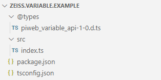
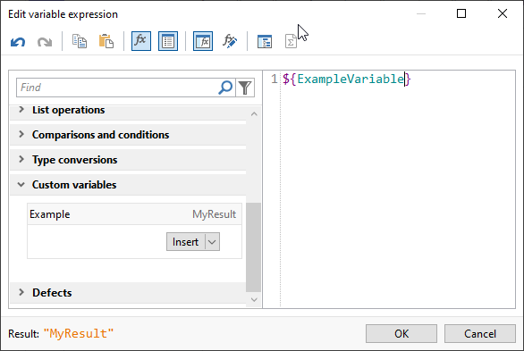

# PiWeb Variable Extension


## Reference Manual

A comprehensive manual can be found [here](http://zeiss-piweb.github.io/PiWeb-Variable-Extension).

## Quickstart

In order to create your first own variable extension, you should be familiar with **JavaScript** and **Json**. As JavaScript is untyped, we suggest you to develop your extension using **TypeScript**.  

PiWeb searches for extensions in several locations. Ordered by their priority, these are:

* In the application data directory `%APPDATA%\Zeiss\PiWeb\Extensions`  
* In the program data directory `%PROGRAMDATA%\Zeiss\PiWeb\Extensions`
* The `Extensions` folder in the PiWeb installation directory

The package structure looks like the following:



**Hint:** You can download the result of the quickstart guide [here](https://github.com/ZEISS-PiWeb/PiWeb-Variable-Extension/raw/master/MyExtension.zip).

### 1. Create the folder `MyExtension` 

In case the `Extensions` folder doesn't exist, you must **create** it first. Place it in one of the folders listed above. Now **create your project folder** in the extensions folder and name it `MyExtension`.

### 2. Create the file `package.json`

The package configuration contains static parameters of your extension. A complete reference of the options can be found in the chapter [package](modules/package.html). For now, use the minimum setup shown below.

```json
{
	"name": "zeiss.variable.example",
	"version": "1.0.0",
	"main": "lib",
	"engines": {
		"piweb": "^1.0"
	},
	"piweb_actions": {
		"load": "compile_typescript"
	},
	"piweb_extension": {
		"type": "variable",
		"variables": {
			"ExampleVariable":{
				"title" : "Example",
			}
		}
	}
}
```


### 3. Create the file `tsconfic.json`

It contains necessary information for the typescript compiler, like input and output directories and compiler switches. Just copy the code below and you'll be fine.

```json
{
    "compilerOptions": {
    "target": "es6",
    "strictNullChecks": true,
    "module": "commonjs",
    "sourceMap": false,
    "moduleResolution": "node",
    "noImplicitAny": true,
    "outDir" : "lib",       
    "rootDir" : "src",
    "typeRoots": ["./@types"]
    }
}
```

### 4. Create the folder `@types` and copy the file `piweb_variable_api-1-0.d.ts` into it

These are the type definitions of the PiWeb variable extension interface. It will enable productivity features like syntax highlighting and auto completion in your IDE. You can find this file **[here](https://github.com/ZEISS-PiWeb/PiWeb-Variable-Extension/blob/master/piweb_variable_api-1-0.d.ts)**. The folder `@types` was defined as the type root in the `tsconfig.json` file.

### 5. Create the folder `src` and create the file `index.ts` in it

 This is where your variable is actually calculated. In the example below, we simply return the fixed string `MyResult`. Many interfaces of PiWeb are available to the variables.

```TypeScript
import * as piweb from 'piweb'

piweb.events.on("calculate", calculate);

function calculate() : piweb.expressions.ExpressionDataType {

	return "MyResult";
}
```

When we save all files and start PiWeb Designer, we should find our extension in the **User defined** category of the variable editor:



For a complete reference, please have a look at the [Index](http://zeiss-piweb.github.io/PiWeb-Variable-Extension).
